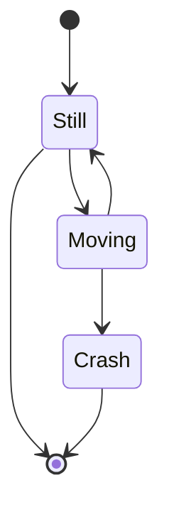
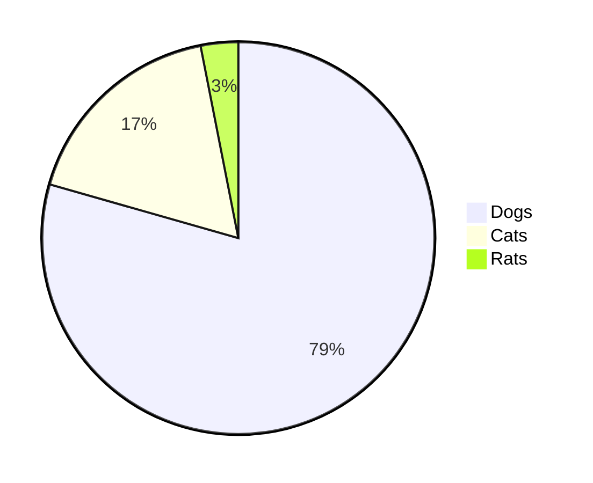
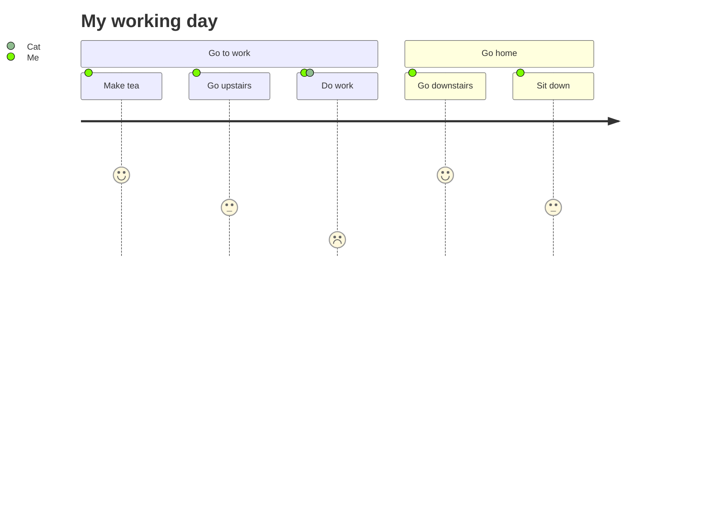

# mermaid

* 線上使用 mermaid -- https://mermaid.live/

## stateDiagram

```
stateDiagram-v2
[*] --> Still
Still --> [*]
Still --> Moving
Moving --> Still
Moving --> Crash
Crash --> [*]
```




## pie

```
pie
"Dogs" : 386
"Cats" : 85
"Rats" : 15
```



## journey

```
  journey
    title My working day
    section Go to work
      Make tea: 5: Me
      Go upstairs: 3: Me
      Do work: 1: Me, Cat
    section Go home
      Go downstairs: 5: Me
      Sit down: 3: Me
```




